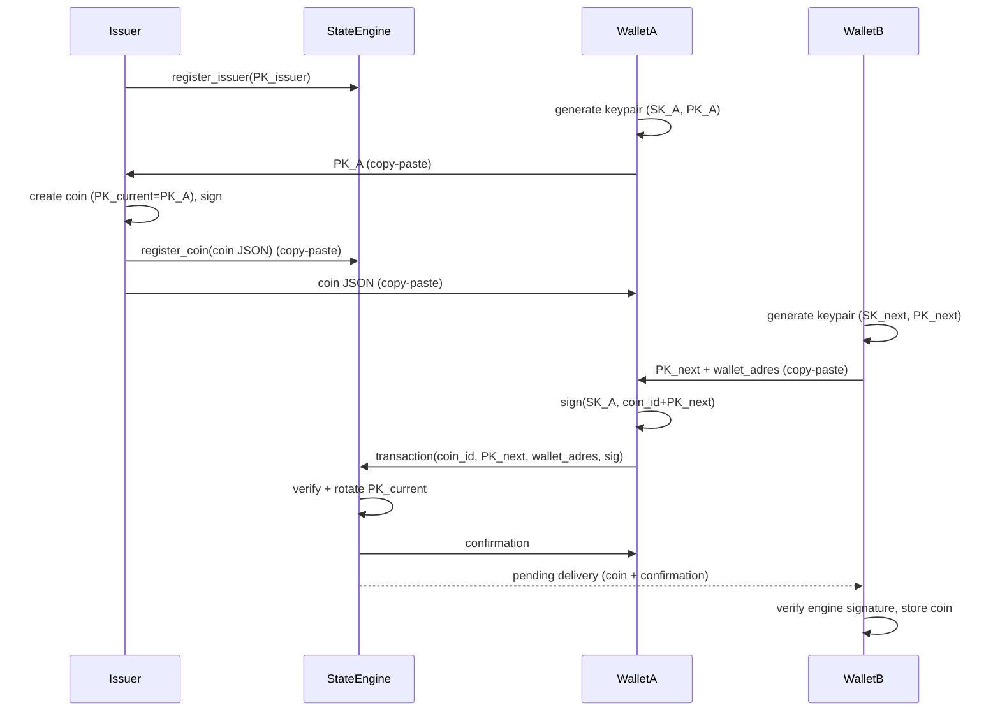

# Crisis Betalingssysteem — Bouwplan

## Projectstructuur

```
lora-en-pkicash-wallet/
├── opzet.txt
├── requirements.txt              # pynacl, flask
├── src/
│   ├── __init__.py
│   ├── crypto_utils.py           # Gedeelde Ed25519 helpers
│   ├── coin.py                   # Coin dataclass + JSON
│   ├── issuer.py                 # Issuer: keypair + coin aanmaak
│   ├── engine.py                 # State engine: SQLite + verificatie + rotatie
│   └── wallet.py                 # Wallet: key management + transacties
├── app.py                        # Flask app met routes per rol
├── templates/
│   ├── base.html                 # Shared layout met navigatie (4 tabs)
│   ├── bank.html                 # Scherm 1: Bank/Issuer medewerker
│   ├── engine.html               # Scherm 2: State Engine beheerder
│   └── wallet.html               # Scherm 3+4: Wallet (herbruikt voor A en B)
├── static/
│   └── style.css
└── tests/
    ├── test_issuer.py
    ├── test_engine.py
    ├── test_wallet.py
    └── test_integration.py
```

---

## Fase 1: Core logica

### 1a. `crypto_utils.py` — Gedeelde crypto helpers

Centrale plek voor alle PyNaCl operaties:

- `generate_keypair()` → `(SigningKey, VerifyKey)`
- `sign(sk, message_bytes)` → `signature_bytes`
- `verify(pk_bytes, message_bytes, signature_bytes)` → `bool`
- `sk_to_hex()` / `pk_to_hex()` — serialisatie naar hex voor JSON
- `pk_from_hex()` / `sk_from_hex()` — deserialisatie

### 1b. `coin.py` — Coin datamodel

Dataclass met velden: `coin_id`, `waarde`, `pk_current`, `pk_issuer`, `issuer_signature`, `state_engine_endpoint`, `pk_engine` (alle keys hex-encoded in JSON).

Methoden: `to_dict()` / `from_dict()`, `signing_payload()`, `verify_issuer(pk_issuer)`.

### 1c. `issuer.py` — Issuer

- `Issuer` class met eigen keypair
- `issue_coin(waarde, pk_owner, engine_endpoint, pk_engine)` → `Coin`
  - Ontvangt PK van wallet, zet PK_current = pk_owner, signeert met SK_issuer
- `save_key()` / `load_key()` — persist naar bestand

### 1d. `engine.py` — State Engine

SQLite schema:

```sql
CREATE TABLE coins (
    coin_id TEXT PRIMARY KEY,
    pk_current TEXT NOT NULL
);
CREATE TABLE trusted_issuers (
    pk_issuer TEXT PRIMARY KEY
);
CREATE TABLE pending_deliveries (
    id INTEGER PRIMARY KEY AUTOINCREMENT,
    recipient_address TEXT NOT NULL,
    coin_json TEXT NOT NULL,
    confirmation TEXT NOT NULL,
    delivered INTEGER NOT NULL DEFAULT 0
);
```

`StateEngine` class:

- `register_issuer(pk_issuer)` — voegt trusted issuer toe
- `register_coin(coin)` — valideert issuer_signature, slaat coin_id + pk_current op
- `process_transaction(tx)` — kernlogica:
  1. Check coin_id bestaat
  2. Check tx.signature geldig met opgeslagen pk_current over `coin_id + pk_next`
  3. Roteer: update pk_current → pk_next
  4. Sla coin + bevestiging op in pending_deliveries voor recipient_address
  5. Retourneer gesigneerde bevestiging aan afzender (met SK_engine)
- `get_pending_deliveries(wallet_address)` — haalt onafgeleverde coins op, markeert als delivered

Double spend wordt automatisch geblokkeerd door key-rotatie: na rotatie matcht de oude SK niet meer met de nieuwe PK_current.

### 1e. `wallet.py` — Wallet

JSON-file opslag per wallet met per coin: `coin_id`, coin data, `sk_current`.

- `generate_receive_keypair()` → `(pk_hex, sk_hex)`
- `add_coin(coin, sk)` — slaat coin + private key op
- `list_coins()` — overzicht coin_id + waarde
- `create_transaction(coin_id, pk_next)` → `Transaction` dict (gesigneerd)
- `confirm_send(coin_id)` — verwijdert coin na bevestiging
- `validate_coin(coin, trusted_issuers)` → bool

---

## Fase 2: Web UI — Rolkeuze + 4 schermen

Eén Flask app (`app.py`) met een startpagina voor rolkeuze.

### Startpagina (rolkeuze)

Route: `/`

5 knoppen:

- **Bank medewerker** → opent `/bank`
- **State Engine beheerder** → opent `/engine`
- **Wallet A** → opent `/wallet/a`
- **Wallet B** → opent `/wallet/b`
- **Demo modus** → opent alle 4 als aparte browser-tabs (via JavaScript)

In enkele-rol modus: geen navigatiebalk naar andere rollen (je ziet alleen je eigen scherm).
In demo modus: navigatiebalk bovenaan om snel te wisselen.

### Scherm 1: Bank (Issuer medewerker)

Route: `/bank`

Acties:

- **Keypair genereren** — knop, toont PK_issuer (hex) om te kopiëren
- **Coin uitgeven** — formulier:
  - Waarde (getal)
  - PK ontvanger (plak PK van wallet)
  - Engine endpoint (URL van de state engine)
  - PK_engine (plak PK van de engine)
  - → maakt coin aan, toont coin JSON om te kopiëren
- **Overzicht** — lijst van uitgegeven coins met coin_id en waarde

### Scherm 2: State Engine (beheerder)

Route: `/engine`

Acties:

- **Keypair genereren** — knop, toont PK_engine om te kopiëren
- **Issuer registreren** — plak PK_issuer (van bank), voegt toe aan trusted list
- **Coin registreren** — plak coin JSON (van bank), valideert issuer_signature, registreert coin
- **Overzicht** — tabel met geregistreerde coins (coin_id, pk_current) en trusted issuers
- **Pending deliveries** — coins die wachten op aflevering bij een wallet

Transacties worden automatisch verwerkt via API.

### Scherm 3+4: Wallet A / Wallet B

Routes: `/wallet/a` en `/wallet/b` (zelfde template, andere wallet-instantie)

Acties:

- **Keypair genereren** — toont PK (om te kopiëren naar bank of andere wallet)
- **Coin ontvangen van bank** — plak coin JSON (van bank) → wallet koppelt aan eigen SK
- **Saldo overzicht** — lijst coins met waarde + totaal
- **Betaalverzoek** — genereer nieuw keypair, toont PK_next + wallet-adres om te kopiëren
- **Betalen** — selecteer coin, plak PK_next + ontvanger-adres → transactie naar engine
- **Ontvangen coins** — push-melding (via JS polling) als engine een coin heeft afgeleverd
- **Transactie log** — geschiedenis van verzonden/ontvangen

### Communicatie-flow via copy-paste

**Setup (eenmalig):**

1. Engine: "Keypair genereren" → kopieer PK_engine
2. Bank: "Keypair genereren" → kopieer PK_issuer
3. Engine: plak PK_issuer bij "Issuer registreren"

**Coin uitgifte:**
4. Wallet A: "Keypair genereren" → kopieer PK_A
5. Bank: vul "Coin uitgeven" in (waarde, PK_A, engine endpoint, PK_engine) → kopieer coin JSON
6. Engine: plak coin JSON bij "Coin registreren"
7. Wallet A: plak coin JSON bij "Coin ontvangen van bank"

**Betaling A → B:**
8. Wallet B: "Betaalverzoek" → kopieer PK_next + wallet-adres
9. Wallet A: "Betalen" → selecteer coin, plak PK_next + adres → transactie naar engine
10. Engine: verwerkt, slaat coin op als pending delivery voor Wallet B
11. Wallet B: ontvangt push-melding, coin verschijnt automatisch in saldo

Copy-paste als communicatielaag — later vervangbaar door LoRa/Reticulum.

---

## Fase 3: Tests

- `test_issuer.py`: keypair, coin creatie, signature verificatie
- `test_engine.py`: registratie, rotatie, double spend blokkade
- `test_wallet.py`: keypair, coin opslag, transactie signing
- `test_integration.py`: end-to-end flow (issuer → engine → wallet A → wallet B → double spend fail → keten-test)

---

## Dataflow diagram




## Key conventions

- Alle keys worden als **hex strings** geserialiseerd in JSON
- Signing payloads: deterministische byte-concatenatie
- Alle crypto via `crypto_utils.py`, geen directe PyNaCl imports elders
- Custom exceptions: `InvalidSignature`, `DoubleSpendError`, `UnknownCoinError`
- Copy-paste als communicatie tussen schermen (later LoRa)

