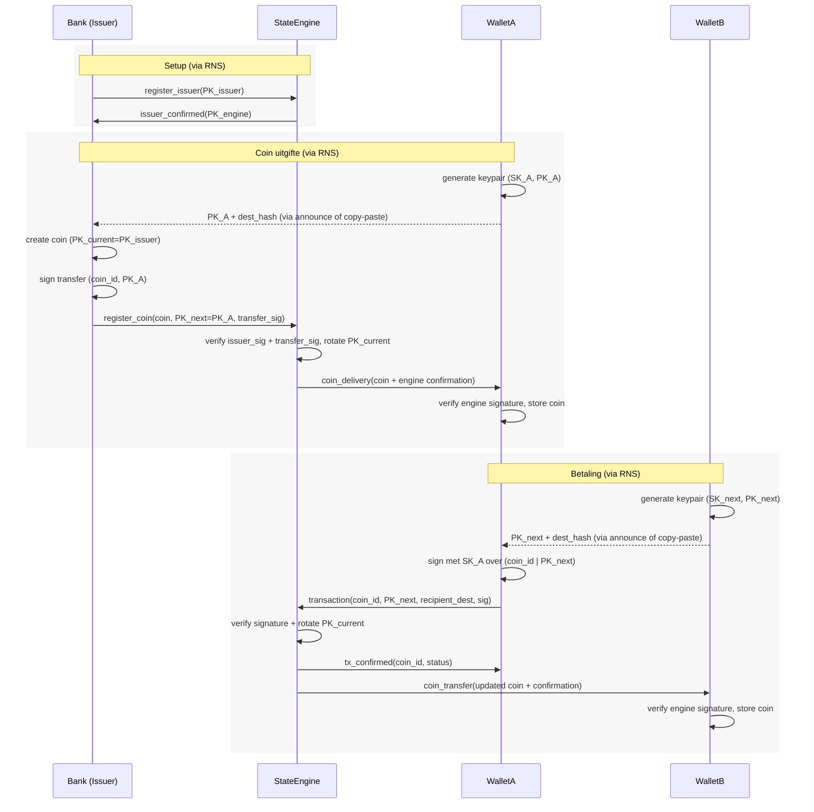
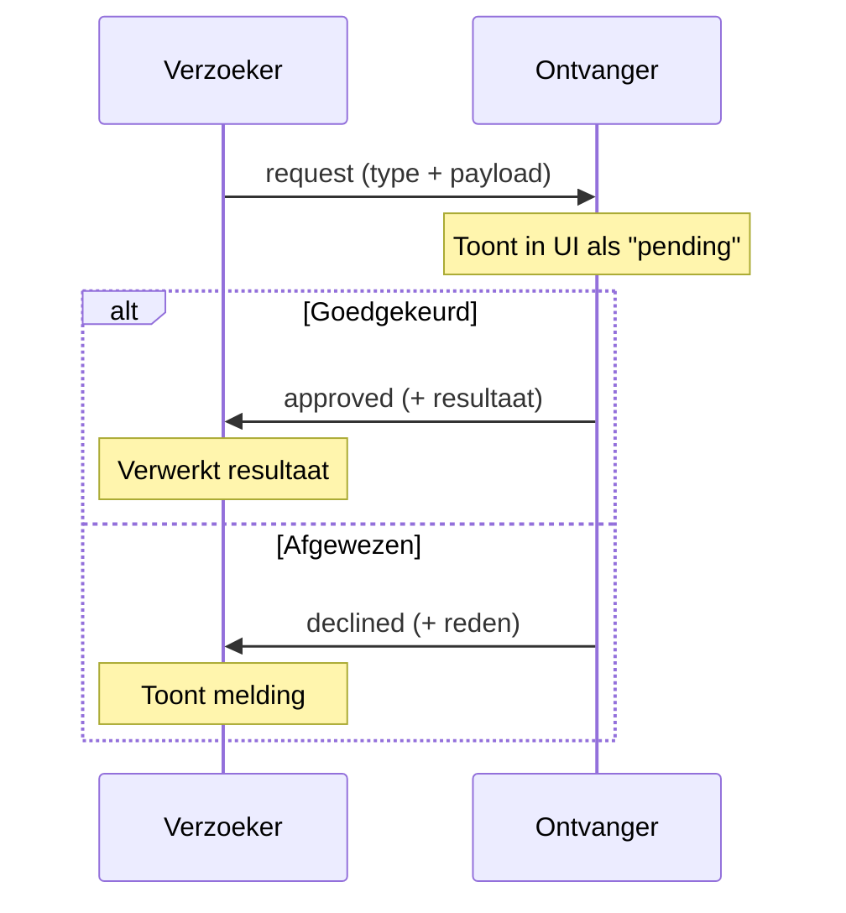
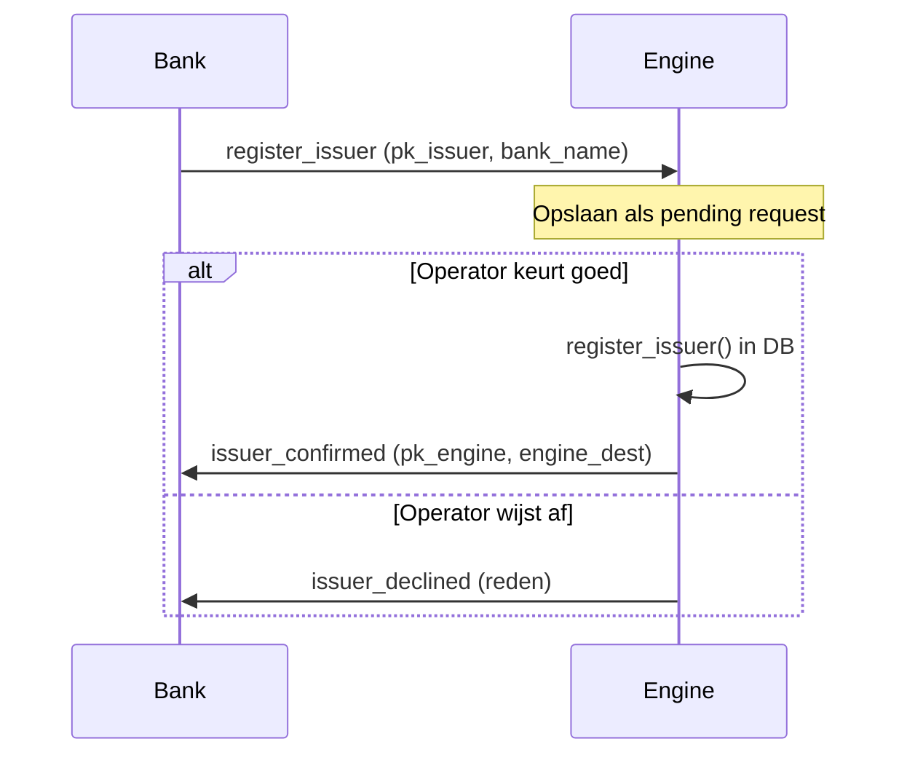
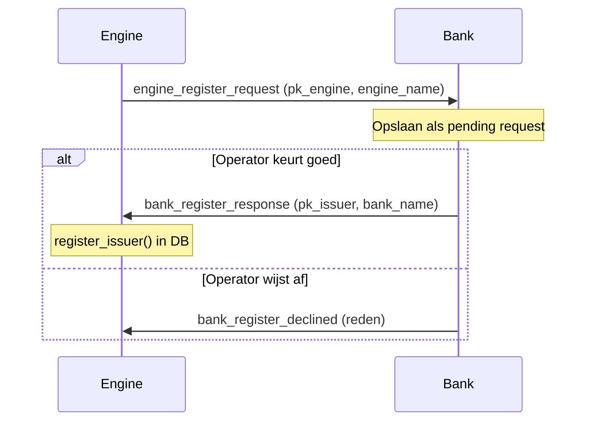
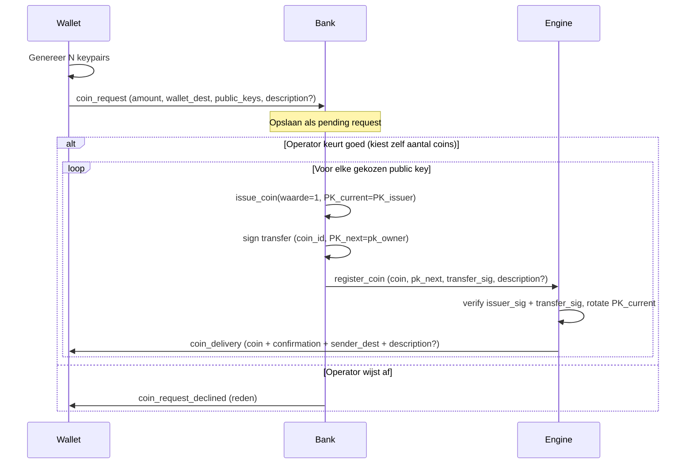
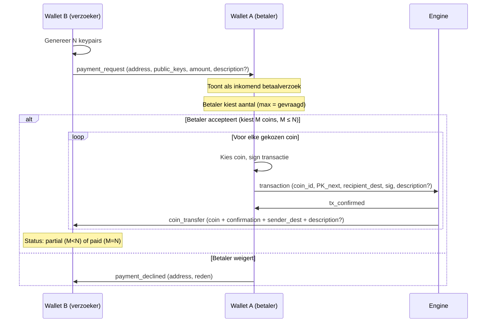

Project Briefing: Crisis Betalingssysteem (PKI Cash)
====================================================

Concept
-------
Een offline-first digitaal betalingssysteem voor crisisscenarios zonder internet,
gebaseerd op PKI cryptografie en een lokale state engine. Communicatie verloopt
via Reticulum Network Stack (RNS) — nu over TCP (localhost), later over LoRa radio.

Filosofie achter het ontwerp
----------------------------
Een munt is geen bestand met waarde. Een munt is een exclusief vermogen om een
geldige state-overgang te ondertekenen. Eigendom is geen bezit van een object,
maar controle over een private key die op dit moment geldig is voor precies één
coin. Dit onderscheid is belangrijk voor alle ontwerpkeuzes die volgen.

Wat een munt is
---------------
Een munt is een klein JSON bestandje:

  {
    "coin_id": "<uuid>",
    "waarde": 10,
    "PK_current": "<publieke sleutel huidige eigenaar>",
    "PK_issuer": "<publieke sleutel uitgever>",
    "issuer_signature": "<handtekening van uitgever over coin_id + waarde + PK_issuer>",
    "state_engine_endpoint": "<dest hash van de state engine>",
    "PK_engine": "<publieke sleutel van de state engine>"
  }

De waarde in issuer_signature is het resultaat van: sign met SK_issuer over
(coin_id | waarde | PK_issuer). De private key SK_issuer zit NIET in de coin —
alleen het resultaat (de signature hex bytes). Verificatie gaat met PK_issuer
(publieke sleutel) die al in de coin staat.

Bij creatie is PK_current = PK_issuer (de bank bezit de coin). De bank maakt
vervolgens een transfer_signature aan: sign met SK_issuer over (coin_id | PK_next),
identiek aan een wallet-transfer. De state engine verifieert beide signatures en
roteert PK_current naar PK_next (de ontvanger). Zo is coin-uitgifte conceptueel
identiek aan een gewone betaling.

Zonder geldige issuer_signature is de coin waardeloos.

Twee sleuteltypen
-----------------
Elke actor heeft twee soorten sleutels:

| Type            | Bron                     | Doel                                                  |
| --------------- | ------------------------ | ----------------------------------------------------- |
| PK_identity     | RNS.Identity()           | Transport: routing, announcements, berichtverificatie |
| PK_transactie   | PyNaCl Ed25519 (bestaand)| Coins: issuer signatures, eigendomsoverdracht         |

- PK_identity wordt automatisch beheerd door RNS (opgeslagen in data/<actor>/identity)
- PK_transactie = bestaande logica (issuer.key, engine.key, wallet ephemere keys)
- Destination hash = automatisch afgeleid door RNS uit identity + "pkicash" + role

Hoe het systeem werkt
---------------------

### Eigendom
Eigendom van een coin = je bezit SK_current, de private key die hoort bij
PK_current op de coin.

### Een transactie
1. Ontvanger genereert een nieuw keypair (PK_next, SK_next) en stuurt PK_next
   naar de betaler (= het "betaalverzoek")
2. Betaler maakt een transactiebericht: {coin_id, PK_next} gesigneerd met
   SK_current
3. Betaler stuurt dit via RNS naar de state engine
4. State engine verifieert en roteert PK_current naar PK_next
5. State engine stuurt coin via RNS naar de ontvanger

### Wat de state engine doet
Bij coin registratie (uitgifte):
1. Verifieert issuer_signature op de coin met bekende PK_issuer
2. Verifieert transfer_signature met PK_current (= PK_issuer bij nieuwe coin)
3. Roteert PK_current naar PK_next (de ontvanger)
4. Stuurt coin met gesigneerde bevestiging via RNS naar ontvanger

Bij transactie (overdracht):
1. Verifieert transactie signature met PK_current
2. Roteert PK_current naar PK_next bij geldige transactie
3. Stuurt gesigneerde bevestiging via RNS terug
4. Double spend: geeft error bij hergebruik van oude PK

De state engine bewaart alleen: coin_id → PK_current
Geen geschiedenis, geen identiteit, geen saldo's.

### Transactie formaat
  {
    "coin_id": "<uuid>",
    "PK_next": "<publieke sleutel ontvanger>",
    "recipient_address": "<dest hash van ontvanger wallet>",
    "signature": "<handtekening van eigenaar over coin_id + PK_next>"
  }

De waarde in signature is het resultaat van: sign met SK_current over
(coin_id | PK_next). De private key SK_current zit NIET in het bericht —
alleen het resultaat (de signature hex bytes). Verificatie door de state engine
gaat met PK_current die de engine al kent.

Vertrouwensmodel
----------------
Een valuta wordt gedefinieerd door PK_issuer (niet door een naam). Coins zonder
geldige issuer_signature van een vertrouwde PK_issuer worden geweigerd.

In een crisissituatie zijn er drie bronnen van vertrouwen:
- Vooraf ingebed vertrouwen (QR codes, papier, vooraf geconfigureerde wallets)
- Sociaal vertrouwen (lokale afspraak over geaccepteerde issuers)
- Economisch vertrouwen (inwisselbaarheid bij bekende punten)

Architectuur
------------
Elke actor (engine, bank, wallet) draait als eigen Python-proces:

  ┌──────────────────────────────────┐
  │      Actor Proces (bijv. Bank)   │
  │                                  │
  │   Flask Web UI ←→ Gedeelde State │
  │   (localhost:port)    │          │
  │                       │          │
  │   RNS Transport  ←→──┘          │
  │   (achtergrond-thread)           │
  └──────────────┬───────────────────┘
                 │
        Reticulum Netwerk
        (TCP nu, LoRa straks)

- Flask: lokale webserver voor browser UI
- RNS: achtergrond-thread voor peer-to-peer communicatie
- Gedeelde state: inbox, announces, coins/transacties
- SSE (Server-Sent Events): alleen lokaal (browser ↔ eigen Flask)

### RNS Communicatie

Announce:
- Bij opstart: actor maakt RNS Identity aan (of laadt bestaande)
- Maakt Destination: RNS.Destination(identity, IN, SINGLE, "pkicash", role)
- role = "engine", "bank", of "wallet"
- app_data bij announce bevat: {name, role, pk_transaction}
- pk_transaction in announce:
  - Engine: publieke sleutel voor engine-signing (verificatie van coin deliveries)
  - Bank: PK_issuer (publieke sleutel voor issuer signatures op coins)
  - Wallet: wordt NIET meegegeven (ephemere keys zijn niet nuttig om te publiceren)
- Alle actors ontvangen announces en tonen ze in de UI
- Bij "Opslaan als contact" vanuit announce worden dest_hash + pk_transaction opgeslagen
- Announce datum wordt getoond als "Announce ontvangen op" met nette Nederlandse datumnotatie

Berichttypen (via RNS Link + zlib-compressed JSON):

| Type                    | Van    | Naar              | Inhoud                                    |
| ----------------------- | ------ | ----------------- | ----------------------------------------- |
| register_issuer         | Bank   | Engine            | {pk_issuer, bank_name}                    |
| issuer_confirmed        | Engine | Bank              | {pk_engine, engine_dest}                  |
| issuer_declined         | Engine | Bank              | {reason}                                  |
| engine_register_request | Engine | Bank              | {pk_engine, engine_name, engine_dest}     |
| bank_register_response  | Bank   | Engine            | {pk_issuer, bank_name}                    |
| bank_register_declined  | Bank   | Engine            | {reason}                                  |
| coin_request            | Wallet | Bank              | {amount, wallet_dest, public_keys, description?} |
| coin_request_declined   | Bank   | Wallet            | {reason}                                  |
| register_coin           | Bank   | Engine            | {coin_json, recipient_dest, pk_next, transfer_signature, description?} |
| coin_delivery           | Engine | Wallet            | {coin_json, engine_confirmation, description?} |
| transaction             | Wallet | Engine            | {coin_id, pk_next, sig, recipient_dest, description?} |
| tx_confirmed            | Engine | Wallet(zender)    | {coin_id, status}                         |
| coin_transfer           | Engine | Wallet(ontvanger) | {updated_coin, confirmation, description?} |
| payment_request         | Wallet | Wallet            | {address, public_keys, amount, description?} |
| payment_response        | Wallet | Wallet            | {pk, address, original_request}           |
| payment_declined        | Wallet | Wallet            | {address, reason}                         |

Optionele velden (met ? gemarkeerd):
- description: max 32 tekens, meegegeven door betaler, wordt doorgegeven door
  de hele keten (wallet → bank → engine → ontvanger). Toekomstige LoRa impact:
  +33 bytes binair per bericht.
- amount: het gevraagde aantal coins. Betaler kan minder sturen (max = gevraagd)

Uniforme betaalverzoek flow:
- Wallet stuurt betaalverzoek via EEN endpoint (send-payment-request)
- Backend bepaalt via announces of target een bank of wallet is
- Bij bank: stuurt coin_request met N gegenereerde PKs
- Bij wallet: stuurt payment_request met N gegenereerde PKs
- Betaler (bank of wallet) kiest het aantal coins (max = gevraagd)
- Betaler kan omschrijving aanpassen of toevoegen
- Status tracking: pending → partial (gedeeltelijk) → approved/paid (volledig)
- coin_delivery/coin_transfer bevatten sender_dest voor counterparty-identificatie

Inbox:
- Inkomende RNS packets worden via callback in een thread-safe lijst geplaatst
- Flask UI pollt via SSE (lokaal, browser ↔ eigen Flask)

Dataflow diagram
----------------

Toelichting:
- Alle communicatie gaat via RNS (Reticulum Network Stack)
- --> (stippellijn) zijn handmatige acties (copy-paste announce info)
- Private keys (SK) verlaten NOOIT het apparaat waarop ze zijn aangemaakt

Interactiepatronen (Goedkeuringsflows)
---------------------------------------

Alle cross-actor interacties volgen een universeel verzoek-goedkeuring patroon:

### Bank → Engine: Issuer registratie

De bank stuurt een registratieverzoek. De engine-operator moet goedkeuren.

### Engine → Bank: Registratieverzoek

De engine kan een bank vragen "wil je mij als engine gebruiken?"

### Wallet → Bank: Coin-aanvraag

Een wallet kan coins aanvragen bij een bank.

### Wallet → Wallet: Betaalverzoek

Een wallet kan een betaalverzoek sturen naar een andere wallet.
De betaler kiest hoeveel coins te sturen (max = gevraagd aantal).

Architectuur & Bestanden
------------------------

### Projectstructuur
  lora-en-pkicash-wallet/
  ├── run.py                    # Startscript: --role engine/bank/wallet of --demo
  ├── app_actor.py              # Flask app factory per actor-rol
  ├── app.py                    # Legacy: oude single-server versie (deprecated)
  ├── opzet.md                  # Dit bestand (project briefing)
  ├── requirements.txt          # Python dependencies (flask, pynacl, rns)
  ├── src/
  │   ├── transport.py          # RNS wrapper: identity, destination, announce, send/receive
  │   ├── crypto_utils.py       # Ed25519 keypair, sign, verify (PyNaCl)
  │   ├── coin.py               # Coin dataclass + issuer signature verificatie
  │   ├── issuer.py             # Bank/Issuer: keypair, coin creatie, signing
  │   ├── engine.py             # StateEngine: SQLite, registratie, rotatie, deliveries
  │   └── wallet.py             # Wallet: coins, keypairs, transactielog, contacten
  ├── templates/
  │   ├── base.html             # Basis layout, SSE, announce overlay, globale JS
  │   ├── index.html            # Legacy rolselectie pagina
  │   ├── engine.html           # State Engine UI
  │   ├── bank.html             # Bank/Issuer UI
  │   └── wallet.html           # Wallet UI
  ├── static/
  │   └── style.css             # Alle styling
  ├── tests/
  │   ├── test_issuer.py        # Unit tests Issuer
  │   ├── test_engine.py        # Unit tests StateEngine
  │   ├── test_wallet.py        # Unit tests Wallet
  │   └── test_integration.py   # End-to-end flow test
  └── data/                     # Runtime data (niet in git)
      ├── engine/               # Engine data directory
      │   ├── identity          # RNS identity (PK_identity)
      │   ├── engine.key        # PyNaCl SK (PK_transactie)
      │   ├── engine.db         # SQLite (coin_id → PK_current)
      │   ├── engine_data.json  # Contacten, issuer namen, actor_name
      │   └── announces.json    # Ontdekte actoren
      ├── bank/                 # Bank data directory
      │   ├── identity          # RNS identity
      │   ├── issuer.key        # PyNaCl SK (issuer signing)
      │   ├── bank.json         # Uitgegeven coins, contacten, registraties, actor_name
      │   └── announces.json    # Ontdekte actoren
      └── wallet_<id>/          # Per wallet data directory
          ├── identity          # RNS identity
          ├── wallet.json       # Coins, keypairs, transactielog, contacten, actor_name
          └── announces.json    # Ontdekte actoren

### Opstarten
  python run.py --role engine --port 5000
  python run.py --role bank   --port 5001
  python run.py --role wallet --id a --port 5002
  python run.py --role wallet --id b --port 5003

Of demo-modus (alle vier tegelijk):
  python run.py --demo

### Core logica (src/)
- transport.py    — RNS wrapper: identity management, destination, announce,
                    send/receive via Links, thread-safe inbox, persistent announces
- crypto_utils.py — Ed25519 keypair generatie, signing, verificatie (PyNaCl)
- coin.py         — Coin dataclass met serialisatie en issuer-signature verificatie
- issuer.py       — Issuer: genereert keypair, maakt coins aan, signeert ze
- engine.py       — StateEngine: SQLite DB, issuer registratie, coin registratie,
                    transactie verificatie en PK-rotatie, pending deliveries
- wallet.py       — Wallet: keypair management per coin, transactielogboek,
                    contactenlijst, coin ontvangst/versturen, persistentie via JSON

### Web applicatie
- run.py          — Startscript met rolkeuze. Start RNS transport + Flask per actor.
- app_actor.py    — Flask app factory. Per rol (engine/bank/wallet) worden alleen
                    de relevante routes geregistreerd. RNS transport wordt gedeeld
                    met Flask via gedeelde state.
- templates/      — Jinja2 templates:
    - base.html   — Basis layout, lokale SSE verbinding, announce overlay,
                    globale JS functies (overlay, menu, contactpicker, copy)
    - engine.html — State Engine UI: activatie, issuer registratie, coins, contacten
    - bank.html   — Bank UI: activatie, coin uitgeven, engine registratie, contacten
    - wallet.html — Wallet UI: saldo, transacties, betalen/ontvangen, contacten
- static/style.css — Banking-app stijl, cards, overlays, activatie wizard

### Demo vs. productie

|               | Demo (1 machine)              | Productie (4 laptops)                |
| ------------- | ----------------------------- | ------------------------------------ |
| Processen     | 4 processen, elk eigen port   | 1 proces per laptop                  |
| RNS interface | AutoInterface (localhost TCP)  | LoRa interface via serial            |
| Config        | Automatisch (RNS default)     | Reticulum config met LoRa parameters |
| Browser       | 4 tabs, elk naar eigen port   | 1 tab op localhost:5000              |

UI Design Patterns
------------------
- Header: actor naam (bewerkbaar) + kopieer-adres-icoon + announce-icoon
- Actor naam: bewerkbaar via "Mijn contactgegevens", opgeslagen in data (actor_name),
  gebruikt als titel in header en als naam bij RNS announces.
  Default: "State Engine", "Bank", "Wallet A" (afgeleid van wallet_id)
- Menu (rechtsboven): secties wisselen (overzicht, contacten, mijn gegevens, netwerk, inbox)
- Mijn contactgegevens: naam (bewerkbaar), adres/destination hash (copy-icoon),
  rol, PK transactie (copy-icoon; niet bij wallets). Zelfde layout als netwerk-preview.
- Netwerk overlay: preview van eigen gepubliceerde gegevens, announce knop,
  ontdekte actoren met inline copy-iconen, rol-badge, datum ("Announce ontvangen op")
- Inkomende verzoeken (bank + wallet): uniforme kaart-layout per verzoek met:
  titel + datum/tijd, gevraagd (aantal, door, omschrijving), beslissing (aantal, omschrijving),
  goedkeuren/weigeren knoppen
- Inline meldingen: succes-berichten verdwijnen na 3 seconden
- Contacten: uitklapbare kaarten met naam/adres als header, bewerkbare velden
- Overlays: voor acties (coin uitgeven, issuer registreren, betaalverzoek, betalen)
- Adresboek picker: icoon naast velden, dropdown met contacten
- Auto-split bij plakken: "dest_hash|pk" wordt automatisch gesplitst
- SSE: lokaal (browser ↔ eigen Flask), voor RNS berichten en announces

Technische keuzes
-----------------
- Taal: Python 3.10+
- Cryptografie: PyNaCl (libsodium), Ed25519 voor signing, UUID4 voor coin_id
- Transport: Reticulum Network Stack (RNS) voor peer-to-peer communicatie
- Web framework: Flask (per actor, lokale webserver)
- Database state engine: SQLite
- Frontend: Vanilla HTML/CSS/JS, Lucide icons (CDN)
- Data persistentie: JSON bestanden (wallet, bank, engine contacten)
- Communicatie: RNS over AutoInterface (TCP), later LoRa (Heltec V3, SX1262, 868MHz)

Bewuste beperkingen
-------------------
- Offline transacties: als de state engine niet bereikbaar is kunnen geen
  transacties plaatsvinden (vergelijkbaar met pinbetaling zonder netwerk)
- Verlies private key: coin is onherroepelijk verloren (net als fysiek cash)
- State engine als vertrouwenspunt: wie de engine beheert heeft macht.
  Meerdere engines als backup is een latere uitbreiding
- PK_issuer en PK_engine moeten vooraf verspreid zijn (via announce of handmatig)

Roadmap
-------
1. ✓ Core: Issuer, StateEngine, Wallet, Coin klassen
2. ✓ Web UI: Flask applicatie met banking-app stijl
3. ✓ Contactbeheer: adresboek per actor, bewerkbaar, picker in formulieren
4. ✓ SSE: real-time updates (nu lokaal per actor)
5. ✓ Reticulum transport: elke actor als eigen proces met RNS communicatie
6. ✓ Announce systeem: actoren ontdekken elkaar via RNS announces
7. ✓ RNS berichten: registratie, coin uitgifte, transacties via RNS
8. ✓ Goedkeuringspatroon: alle interacties via request → approve/decline → action
9. ✓ Uniforme betaalverzoek flow: wallet→bank en wallet→wallet via zelfde endpoint
10. ✓ Omschrijving: optioneel description veld (max 32 chars) door hele berichtketen
11. ✓ Professionele transactie-weergave: datumgroepering (Vandaag/Gisteren/datum)
12. ✓ Issuance = transfer: coin uitgifte conceptueel identiek aan overdracht (PK_current=PK_issuer + transfer_signature)
13. ✓ Bewerkbare actor naam: opgeslagen in data, gebruikt bij announce en als titel in header
14. ✓ Netwerk overlay: preview eigen gegevens, inline copy-iconen, nette datumnotatie, announce-icoon in header
16. □ LoRa integratie: Reticulum config met LoRa radio interface
17. □ Binaire encoding: JSON→MessagePack/CBOR + raw bytes voor LoRa optimalisatie
18. □ Meerdere state engines / redundantie
